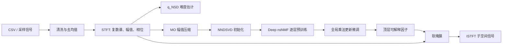

# 架构与算法说明

## 模块边界

| 模块 | 职责 | 主要 API |
|---|---|---|
| `signal` | 非有限值清洗、去均值、周期 Hamming 窗 | `prepare_signal` |
| `stft` | KISS FFT 前向/逆向变换与重叠相加 | `compute_stft`, `inverse_stft` |
| `features` | q_NSD 和 MO 幅值压缩 | `compute_signal_difficulty`, `compress_mo_input` |
| `dnmf` | NNDSVD、逐层 nsNMF、全局微调、周期奖励 | `deep_nsnmf` |
| `reconstruction` | 幅值/相位合成、分量软掩膜 | `reconstruct_subspaces` |
| `pipeline` | 串联全流程并记录分阶段耗时 | `run_pipeline` |
| `io` | CSV 输入与结果导出 | `read_csv_signal`, `write_csv` |

## 数据流



## MATLAB 兼容约定

原程序使用 `NFFT=1024`、窗长 120、hop 20。算法幅值矩阵保留 512 行：
去掉 DC，保留从第一个正频率到 Nyquist 的频点。DC 单独保存，用于 ISTFT
时保持原参考程序的合成方式。

求解目标为：

```text
X ≈ Z1 S1 Z2 S2 ... ZL SL HL
```

其中 `Sl = (1-theta_l)I + theta_l/k * 1`。求解器内部重构和目标函数包含
所有 `S`。与原 `build_layer_reconstructions.m` 一致，对外解释的累计基矩阵
使用 `Z1 Z2 ... ZL`，中间激活矩阵则由深层结果回代得到。这两个概念在
C++ 中分别由 `reconstruct_dnmf` 和 `cumulative_bases` 表达，避免混用。

## 数值稳定性

- 所有输入在进入算法前检查有限性、维度和非负性。
- 乘法更新分母使用可配置 `epsilon=1e-12` 下界，防止除零。
- 每次更新后投影到非负正交域。
- ISTFT 使用窗平方和归一化，处理重叠区的增益。
- MO 压缩前后保持 Frobenius 范数，减小指数变换造成的尺度漂移。

## 复杂度关注点

计算热点是 NNDSVD 和多轮矩阵乘法。对 `F×T` 特征矩阵和首层秩 `r`，
主要更新近似为 `O(FTr)`。当前实现优先保证算法清晰、数值可测和求职展示；
后续性能路线是截断/随机 SVD、Eigen 线程与 BLAS 后端、缓存链式乘积，以及
对长信号使用分块推理。
